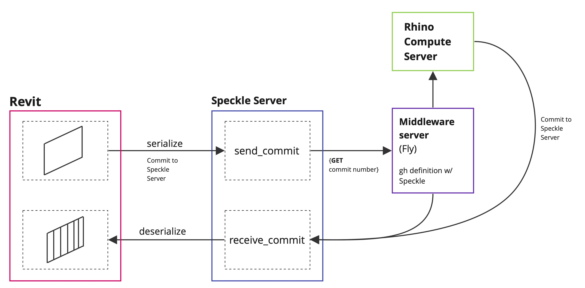

# speckle_compute

# Usage
The project template to deploy a Speckle&lt;-->Rhino.Compute workflow and all of the documentation necessary to cook this cake.

The example in this project uses Speckle to panellise a Wall according to custom Revit parameters that control a Grasshopper definition running on rhino-compute. 

To test it, follow the instructions below.

# Requirements

- Revit 2022 / 2023
- Speckle server / account
- A deployed Rhino Compute Server
- A [Fly.io](http://Fly.io) account

### Revit

Speckle Revit Plug-in Installed.

### Speckle Server

A bot account and its token.

### Middleware

[Fly.io](http://Fly.io) - [https://fly.io/docs/](https://fly.io/docs/)

### Rhino Compute

 [Fly.io](http://Fly.io) account

- Install Lunchbox plug-in (or any required to run your gH definition.

# Instructions

## Project Setup

### Grasshopper

Use example.ghx as a template. Always save as `.ghx`

### Python

1. Clone base repo (dockerfile + [main.py](http://main.py) + fetch.py)
2. Add your .ghx script
3. Adapt [main.py](http://main.py) and fetch.py for the correct stream link + gHscript
4. Generate requirements.txt
    1. `pip install pipreqs`
    2. `pipreqs <your-project-dir>`

## Fly.io

### Install

1. Install fly
    
    `brew install flyctl` (mac)
    
    `powershell -Command "iwr [https://fly.io/install.ps1](https://fly.io/install.ps1) -useb | iex"` (windows)
    
2. Authenticate to your account: `flyctl auth login`

### Deploy

1. in terminal:`cd <your-project-dir>`
2. `flyctl launch`
    1. pick app name
    2. choose region
3. Make the changes to the newly created `fly.toml` :
    1. `kill_signal = "SIGUSR1”`
    2. `kill_timeout = 300`
    3. before `[env]`, place:
        1. `[build]
        builtin = "python"
        [build.settings]
        pythonbase = "3.9-slim-buster"`
    4. `[env]
    PORT = "8080"`
4. Deploy your app - `flyctl deploy`
5. Wait until `deployed successfully`

### Speckle

1. Create two streams and add `computebot` as a collaborator:
    1. Where you will send your geometry: `Send_to_Compute`
    2. Where you will receive your geometry: `Receive_from_Compute`
2. In `Send_to_Compute` go to Webhooks>New Webhook:
    1. URL: https://`<your-app-name>`.fly.dev/webhook
    2. Events: `commit_create`

### Revit

1. Create the shared parameters that will be inputs to your gH definition. In this example:
    1. xdir = `Float`
    2. ydir = `Float`
2. Set `Receive_from_Compute` to Auto-Receive
3. Send your geometry (with parameter information!) to `Send_to_Compute`
    
    [Demo.mp4](example/Demo.mp4)
    
### Local Test
    
You can use `ngrok`as a webhook mirror to your apps local address.
    
1. In terminal: `ngork http [http://0.0.0.0:8080](http://0.0.0.0:8080/)`
2. Set your Speckle webhook URL as [`http://<your-given-hash>.ngrok.io](http://8106-149-90-221-71.ngrok.io/)/webhook`
